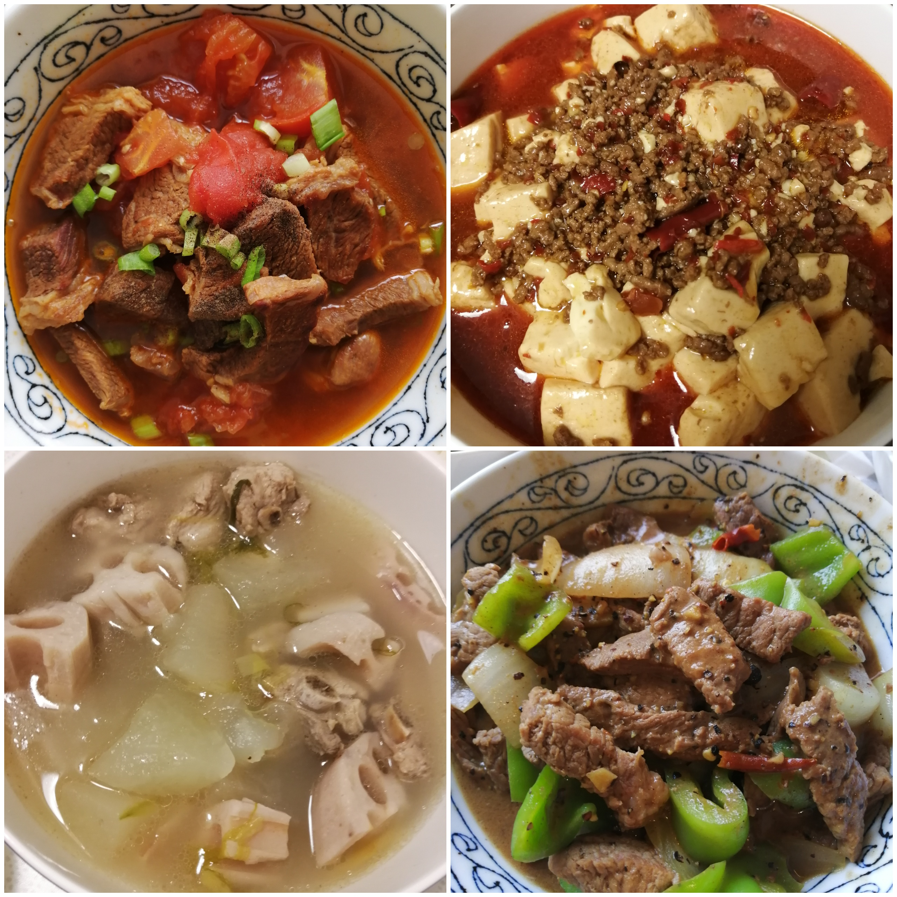

The homemade traditional Chinese food I did : )

## About myself
* MSc candidate
* Mathematics and Statistics
* Data Science
* Volleyball
* Spicy food
* Fingerstyle guitar
* Homebody
* Cinephile

## About this page

It's just a platform to talk to myself, and record my life. 
In terms of study, I will post some of my work, and summarize how I learn data science here. Besides, there might be some posts about interesting things happened in my life. 

## About my work

If you are intersted in what kinds of homework a math/stat student is doing, check out the [homework sample](http://taylantatli.me/Moon/moon-theme/) for more information. 
      
I will keep updating my homepage! Nice to meet you : )
